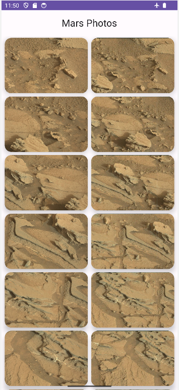
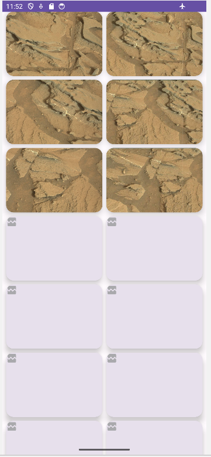
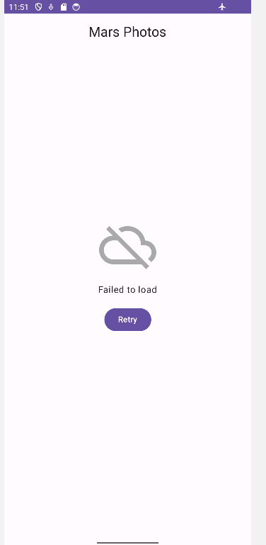

# 🪐 **MarsPhotos**
**MarsPhotos** is a modern Android application developed with Jetpack Compose, enabling images of the surface of Mars to be displayed using a REST API. The project follows Android development best practices, implementing MVVM architecture and using tools like Retrofit for network calls.

## 📋 **Features**
   - 📷 **Display photos of Mars** :

      - ✅ **DONE** Retrieves and displays photos of the surface of Mars via a REST API.
      - ✅ **DONE** Displays the number of images retrieved.

   - 🎨 **Modern and Fluid Interface**:

      - TopBar:
         - ✅ **DONE** Displays application name.
         - ✅ **DONE** Adapts elements to scrolling with dynamic behavior.
      - Light/Dark Mode:
         - ✅ **DONE** Support for light and dark themes with Material 3.

   - 🔄 **Real-time status management**:

      - ✅ **DONE** Use of a ViewModel to store state and manage data retrieved from the API. 

   - 🚀 Performance and responsiveness:
   
      - ✅ **DONE** Support for smooth scrolling and responsive display.             

## 🛠️ **Tech Stack**
   - **Kotlin**: Modern, concise language for Android development.
   - **Jetpack Compose**: Declarative UI toolkit for Android.
   - **Material 3**: Modern, accessible user interface.
   - **StateFlow**: Reactive state management for real-time updates.
   - **ViewModel**: MVVM architecture to separate business logic from user interface.
   - **Retrofit**: Effectuer des appels réseau vers l'API REST.
   - **State Management**: Gestion des états à l'aide de mutableStateOf.
   - **Coil** : Download, buffer, decode and cache images
   
## 🚀 **How to Use**
1. **Launch the App**: 
   - Open the App on a device or emulator.
2. **Discover photos of Mars**:
   - Slide on the Grid to discover the photos of Mars.
   - In case of network Problems, some photos of Mars may be not downloading.
   - If no network at launch, use theretry button to relaunch Mars photos downloading.

   
## 📸 **Screenshots**
- **HomeScreen**:

  

- **HomeScreen with network problems**:

  

- **Home Screen with no network at launch**:

  

## 🤝 **Contributions**
Contributions are welcome! Feel free to fork the repository and submit a pull request for new features or bug fixes.✅🟩❌